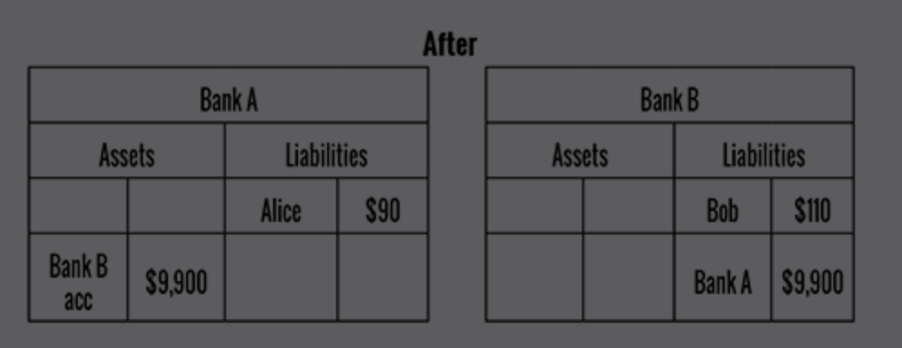
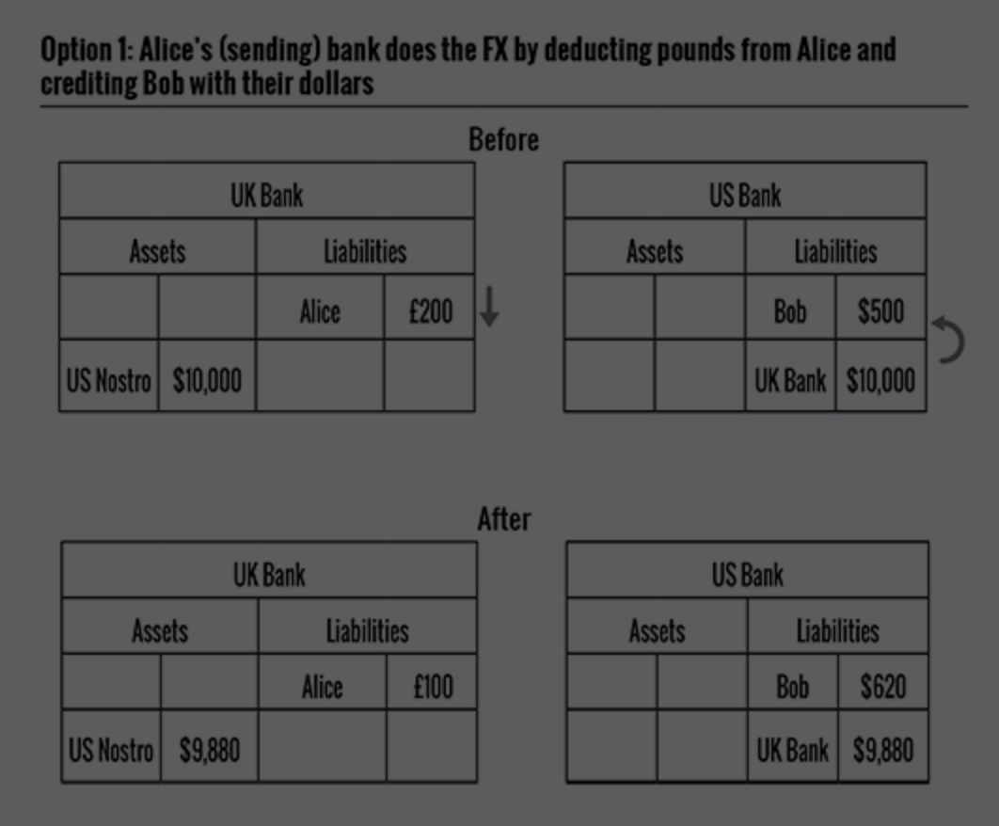

# The Basics of Bitcoins and Blockchains
#### An Introduction to Cryptocurrencies and the Technology That Powers Them
Antony Lewis 2018

## Category
Blockchain, Finance

## Structure
- Chap 0-3: introduce basic terms & concepts:
  - Money & digital money
  - Cryptography
- Chap 4-6: applications
  - Cryptocurrencies & digital tokens:
    - What they are
    - How to buy, store, and sell them
    - How to explore their blockchains
    - The risks in managing them
  - Blockchain technologies being explored by businesses
- Chap 7-8: investment
- Chap 9: summary & predictions

## Author's problems & solution
- Cover the basics of bitcoins, blockchains and cryptocurrencies without requirement of any specific expertise: OK

## Presentation & style
- Author's promise:
  - Be unbiased
  - Use analogy but not excessively
- Lots of graphs, diagrams & illustrations

## Terms
- Public/permissionless (vs private/permissioned) blockchain: list of transactions can be written by anyone
- Representative & fiat currency
- Quantitative easing
- Clearing bank
- Correspondent bank account
- Interbank settlement system
- Nostro: a bank's denominated bank account with another bank in other country
- Euro-currency
- MTO: money transfer operator (eg Transferwire)

## Arguments
### 1. Money
- Cash advs:
  - No third party involved
  - Not contains identity info
  - Transaction can't be undone
- Cash disavd: can't transfer remotely
- Digital money:
  - Relies on trusted bookkeepers to keep track of accounts' balance (how much they owe you):
    - Pay when demanded
    - Transfer to someone else when requested (increase/decrease account balance)
  - Require identify information by laws
- Online (card not present transaction): higher rate of fraud, need to check detailed info
- Money definition by 3 functions:
  - Medium of exchange: payment mechanism, widely accepted in the context of exchange
  - Store of value: will be worth the same in the near future
  - Unit of account: can be used to compare value of 2 items or count up total value of your assets
- Bitcoin as money:
  - Medium of exchange: can be used as payment mechanism but not widely accepted (accepted case is just a workaround: convert to current price -> payment made -> trade to fiat)
  - Store of value:
    - Not stable due to price volatility (inelastic supply)
    - Has potential to keep value over the long term because of inelastic supply
  - Unit of account:
    - Can't be, due to price volatility
    - Exception: value other cryptocurrencies
- -> Might need to be put in a new asset class, not existing ones (eg asset, money, digital gold)
- Stable coin: need to be backed 1 to 1 with an asset, otherwise the peg is likely to break
- Inherent value of Bitcoin:
  - Most recognized instrument of value that can be transmitted across the internet without permission from intermediaries
  - Censorship resistant
- Representative money: backed by an underlying asset, can be used to claim the asset with a third party
- Fiat money:
  - No intrinsic value, not convertible to an asset
  - -> Doesn't matter, as it has utility
  - Value derive from utility:
    - Legal tender: declared by law that it must be accepted as valid payment mechanism including tax
    - Govs only accept their own fiat for tax payment
- Gresham Law: bad money drives out good: people keep good money (eg more gold content) & use bad one
- -> Good money no longer in circulation
- US central bank:
  - Monopoly on the price and quantity of money
  - Responsibility: maximize employment & ensure prices stability
- Currency peg:
  - Declaration by authority that one currency worth a fixed amount of another currency
  - Maintained by:
    - Threat
    - Matching supply and demand: have enough of both currencies to match any amount traders want to exchange
    - -> Easy with home currency (can create more), but harder with the other currency
- Quantitative easing:
  - Central bank buy assets (usually bonds) from private sector (commercial banks, asset managers, hedge funds...) in secondary market
  - -> Might be risky assets -> Damage its balance sheet
  - Buy from: clearing banks (directly or clearing banks as brokers)
- -> Increase amount if fiat money in circulation to stimulate slow economy
- History of money: "whatever form it takes, it gets watered down either through debasement or by excessive creation until a certain limit, then there is a reform"

### 2. Digital money
- How digital money is currently used to settle debts
- How money moves around the financial system
- Note: there is one typo in the figures: should be 9990, not 9900

- Money in customer accounts is a liability of the banks:
  - The bank owe the account owner this amount
  - Should pay the account owner on demand or pay someone else when instructed by the owner
- Same bank payment: increase/decrease corresponding accounts
- Interbank payment:
  - Need to pay each other to balance the changes in liability
  - How:
    - Transfer physical money
    - Use correspondent bank accounts (accounts that banks open with other banks)
      - 
      - 
    - -> Difficulty in maintaining bank accounts with all banks
    - Use central bank payment system:
      - Each banks hold an account with central bank (clearing account), to be used for interbank payment
      - Interbank settlement system: system that manage those accounts:
        - Deferred net settlement systems: add up payments, sum up and pay after a given period (eg 1 day)
        - Real time gross settlement systems: pay in real time
        - -> Banks need more capital to settle all payments immediately
          - 
      - Clearing banks: banks allowed to have accounts with central bank
      - -> Smaller/foreign banks need to open clearing accounts with clearing banks
    - -> Only work within one jurisdiction and one currency
- International payment, same currency:
  - No central bank of the world to clear international commercial payments
  - -> Need to rely on correspondent banking systems
  - Bank uses a correspondent bank account with a bank in other country for all its customers' foreign money
  - 
  - Cases:
    - Currency leaves/returns its domestic currency zone:
      - 
      - 
    - Currency moves outside its domestic currency zone:
      - Both banks have correspondent accounts in the home country of the currency
      - Money transfer between those accounts
  - Banks consider risky might not be able to open account in foreign country
  - -> Need to open account with big local bank which has account in foreign country
  - -> Payment is longer and costs more
- International payment, dif currency (foreign exchange):
  - Need a third party exchanger to take one currency and give other currency
  - Cases:
    - Bank of sender as exchanger:
      - 
    - Bank of receiver as exchanger:
      - 
      - 
    - Money transfer operator (eg Transferwire) as exchanger:
      - 
      - 
  - -> Hold more a currency and less the other currency
  - -> Risk from FX rate fluctuation
- Euro-currency:
  - Currency exists outside its home zone
  - Created when banks loan out foreign money
- -> Not all currency is control by its respective central bank
- E-money wallets:
  - Licence:
    - Easier to obtain compared to banking licence
    - Usually not allowed to loan out money
    - All customers' money must be backed by an equivalent amount in the company's bank account
  - Operation principles:
    - A separate, restricted bank account to contain only customers' money, no other operation allowed
    - Deposit into wallet = transfer money into this account
    - Withdrawal from wallet = transfer from this account to customer's account
    - Transfer to other customer: the wallet provider changes their records of sender/receiver wallet
    - Customers can be companies/organizations
  - Sitting between banks and customers
  - -> Getting more popular due to convenience compared to banks
  - -> Banks need to:
    - Offer better UX
    - Focus on becoming efficient in the background

### 3. Cryptography

### 4. Cryptocurrencies

### 5. Digital tokens

### 6. Blockchain technology

### 7. Initial coin offerings

### 8. Investing

### 9. Conclusion

## Criticism

## Takeaway
