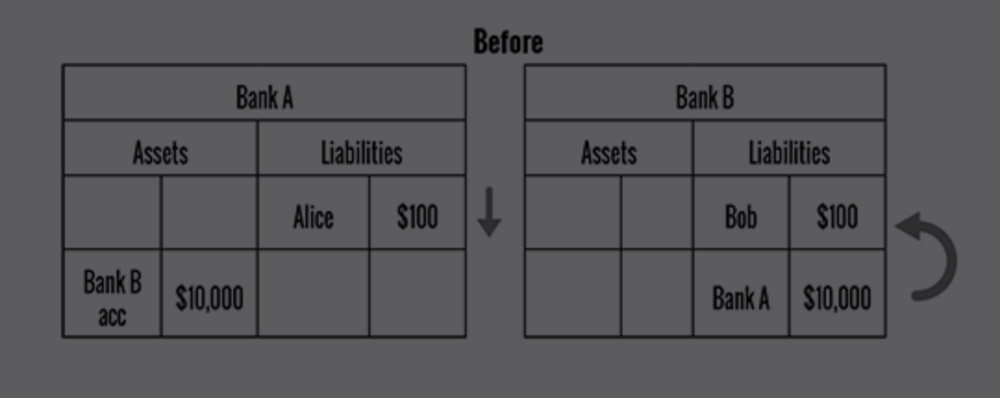
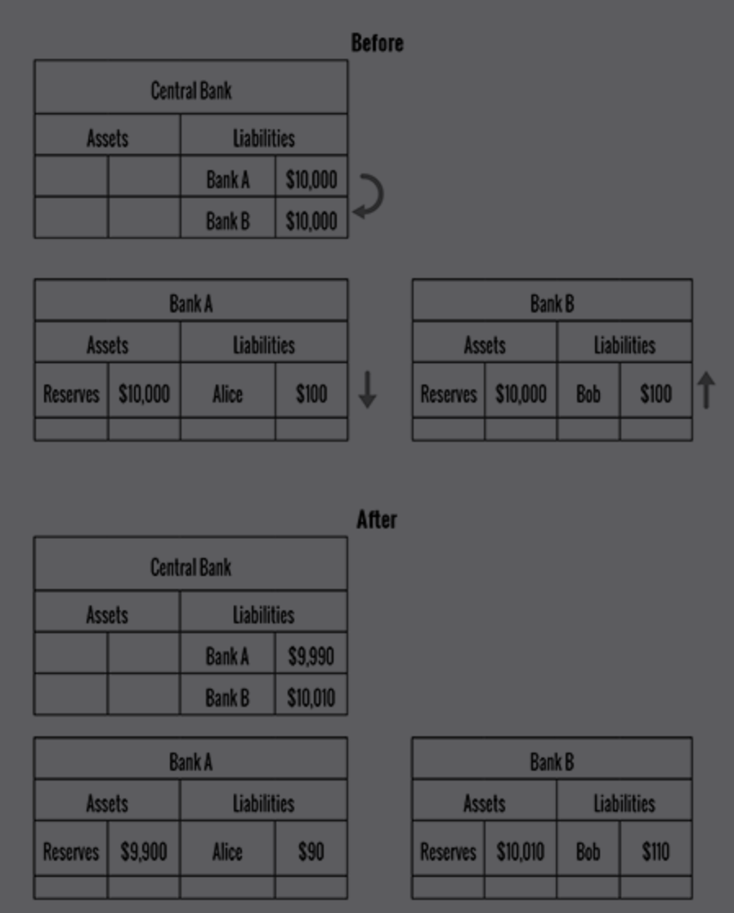
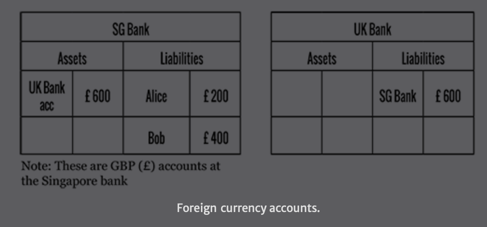
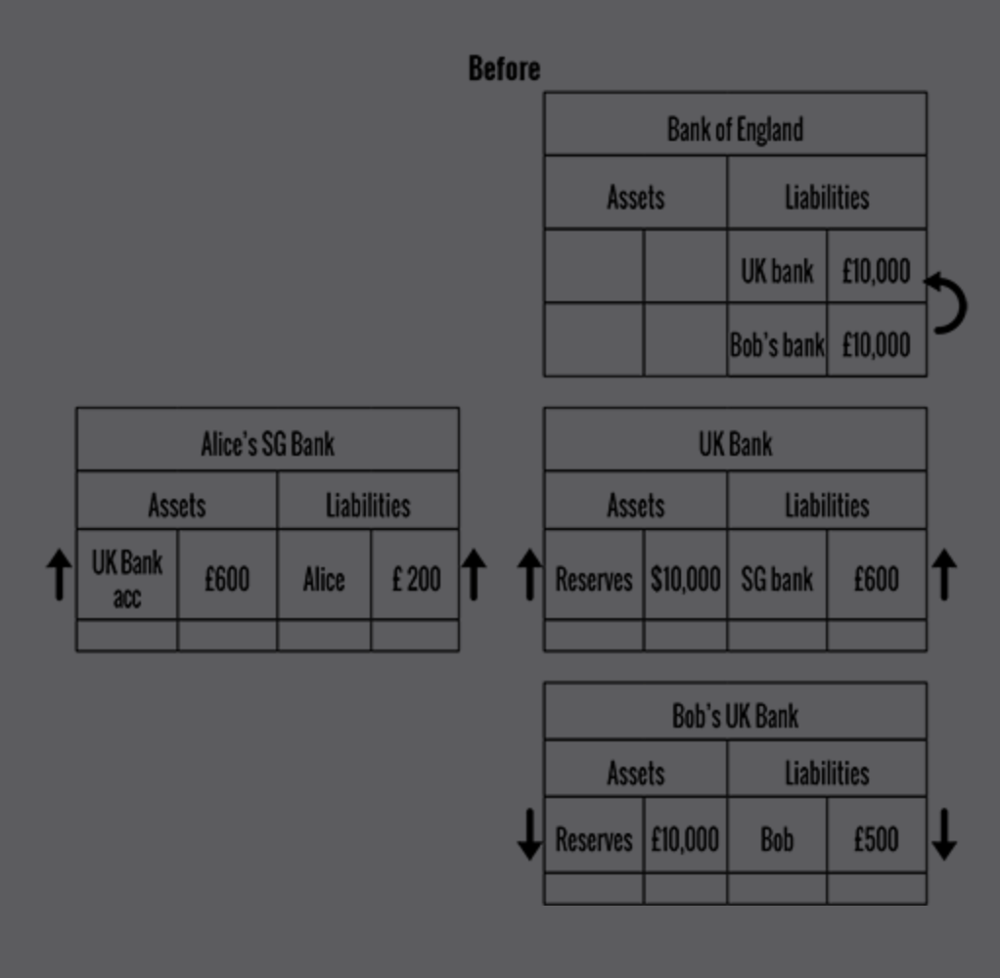
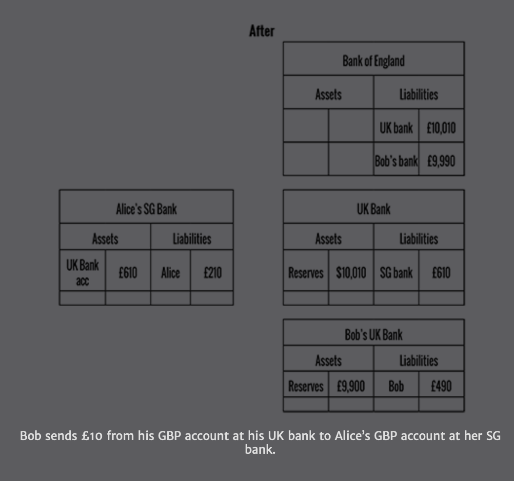
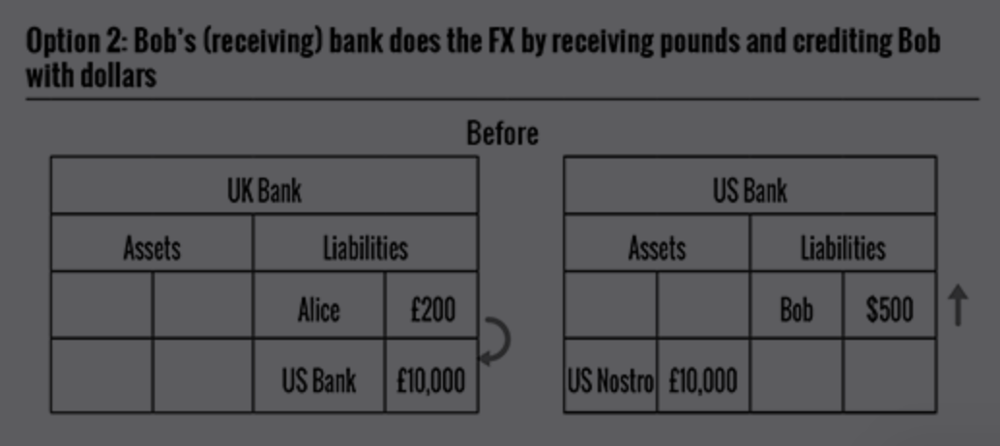
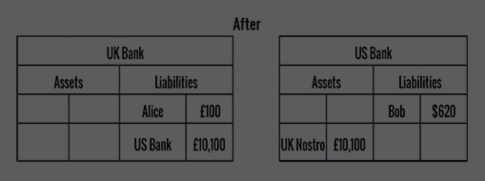
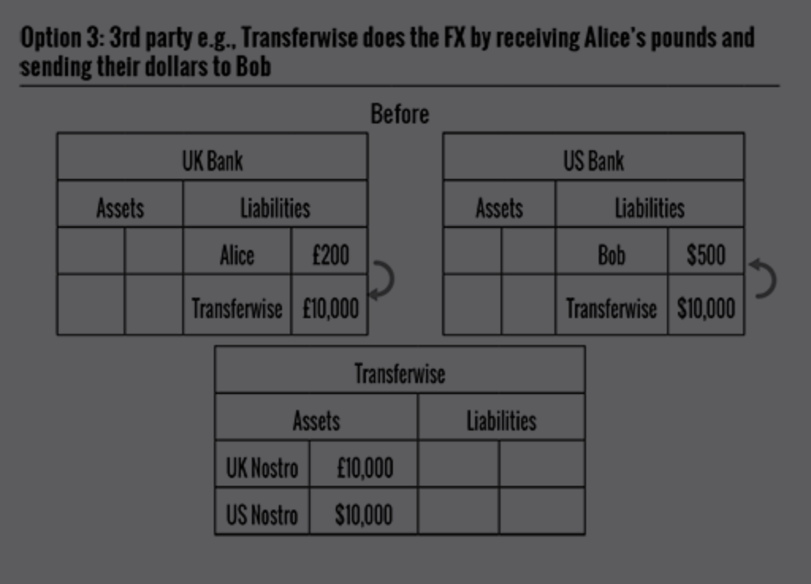
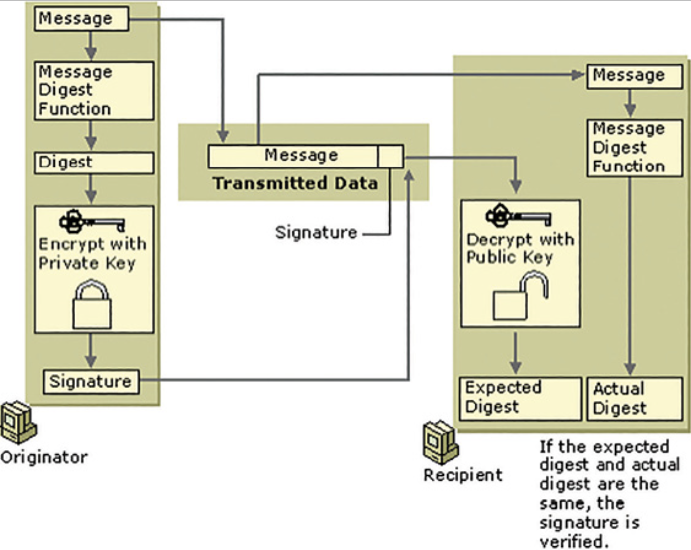

# The Basics of Bitcoins and Blockchains
#### An Introduction to Cryptocurrencies and the Technology That Powers Them
Antony Lewis 2018

## Category
Blockchain, Finance

## Structure
- Chap 0-3: introduce basic terms & concepts:
  - Money & digital money
  - Cryptography
- Chap 4-6: applications
  - Cryptocurrencies & digital tokens:
    - What they are
    - How to buy, store, and sell them
    - How to explore their blockchains
    - The risks in managing them
  - Blockchain technologies being explored by businesses
- Chap 7-8: investment
- Chap 9: summary & predictions

## Author's problems & solution
- Cover the basics of bitcoins, blockchains and cryptocurrencies without requirement of any specific expertise: OK

## Presentation & style
- Author's promise:
  - Be unbiased
  - Use analogy but not excessively
- Lots of graphs, diagrams & illustrations

## Terms
- Public/permissionless (vs private/permissioned) blockchain: list of transactions can be written by anyone
- Representative & fiat currency
- Quantitative easing
- Clearing bank
- Correspondent bank account
- Interbank settlement system
- Nostro: a bank's denominated bank account with another bank in other country
- Euro-currency
- MTO: money transfer operator (eg Transferwire)
- KYC: know your customer: regulatory responsibility of identifying all customers
- Unspent transaction outputs (UTxO)

## Arguments
### 1. Money
- Cash advs:
  - No third party involved
  - Not contains identity info
  - Transaction can't be undone
- Cash disavd: can't transfer remotely
- Digital money:
  - Relies on trusted bookkeepers to keep track of accounts' balance (how much they owe you):
    - Pay when demanded
    - Transfer to someone else when requested (increase/decrease account balance)
  - Require identify information by laws
- Online (card not present transaction): higher rate of fraud, need to check detailed info
- Money definition by 3 functions:
  - Medium of exchange: payment mechanism, widely accepted in the context of exchange
  - Store of value: will be worth the same in the near future
  - Unit of account: can be used to compare value of 2 items or count up total value of your assets
- Bitcoin as money:
  - Medium of exchange: can be used as payment mechanism but not widely accepted (accepted case is just a workaround: convert to current price -> payment made -> trade to fiat)
  - Store of value:
    - Not stable due to price volatility (inelastic supply)
    - Has potential to keep value over the long term because of inelastic supply
  - Unit of account:
    - Can't be, due to price volatility
    - Exception: value other cryptocurrencies
- -> Might need to be put in a new asset class, not existing ones (eg asset, money, digital gold)
- Stable coin: need to be backed 1 to 1 with an asset, otherwise the peg is likely to break
- Inherent value of Bitcoin:
  - Most recognized instrument of value that can be transmitted across the internet without permission from intermediaries
  - Censorship resistant
- Representative money: backed by an underlying asset, can be used to claim the asset with a third party
- Fiat money:
  - No intrinsic value, not convertible to an asset
  - -> Doesn't matter, as it has utility
  - Value derive from utility:
    - Legal tender: declared by law that it must be accepted as valid payment mechanism including tax
    - Govs only accept their own fiat for tax payment
- Gresham Law: bad money drives out good: people keep good money (eg more gold content) & use bad one
- -> Good money no longer in circulation
- US central bank:
  - Monopoly on the price and quantity of money
  - Responsibility: maximize employment & ensure prices stability
- Currency peg:
  - Declaration by authority that one currency worth a fixed amount of another currency
  - Maintained by:
    - Threat
    - Matching supply and demand: have enough of both currencies to match any amount traders want to exchange
    - -> Easy with home currency (can create more), but harder with the other currency
- Quantitative easing:
  - Central bank buy assets (usually bonds) from private sector (commercial banks, asset managers, hedge funds...) in secondary market
  - -> Might be risky assets -> Damage its balance sheet
  - Buy from: clearing banks (directly or clearing banks as brokers)
- -> Increase amount if fiat money in circulation to stimulate slow economy
- History of money: "whatever form it takes, it gets watered down either through debasement or by excessive creation until a certain limit, then there is a reform"

### 2. Digital money
- How digital money is currently used to settle debts
- How money moves around the financial system
- Note: there is one typo in the figures: should be 9990, not 9900

- Money in customer accounts is a liability of the banks:
  - The bank owe the account owner this amount
  - Should pay the account owner on demand or pay someone else when instructed by the owner
- Same bank payment: increase/decrease corresponding accounts
- Interbank payment:
  - Need to pay each other to balance the changes in liability
  - How:
    - Transfer physical money
    - Use correspondent bank accounts (accounts that banks open with other banks)
      - 
      - 
    - -> Difficulty in maintaining bank accounts with all banks
    - Use central bank payment system:
      - Each banks hold an account with central bank (clearing account), to be used for interbank payment
      - Interbank settlement system: system that manage those accounts:
        - Deferred net settlement systems: add up payments, sum up and pay after a given period (eg 1 day)
        - Real time gross settlement systems: pay in real time
        - -> Banks need more capital to settle all payments immediately
          - 
      - Clearing banks: banks allowed to have accounts with central bank
      - -> Smaller/foreign banks need to open clearing accounts with clearing banks
    - -> Only work within one jurisdiction and one currency
- International payment, same currency:
  - No central bank of the world to clear international commercial payments
  - -> Need to rely on correspondent banking systems
  - Bank uses a correspondent bank account with a bank in other country for all its customers' foreign money
  - 
  - Cases:
    - Currency leaves/returns its domestic currency zone:
      - 
      - 
    - Currency moves outside its domestic currency zone:
      - Both banks have correspondent accounts in the home country of the currency
      - Money transfer between those accounts
  - Banks consider risky might not be able to open account in foreign country
  - -> Need to open account with big local bank which has account in foreign country
  - -> Payment is longer and costs more
- International payment, dif currency (foreign exchange):
  - Need a third party exchanger to take one currency and give other currency
  - Cases:
    - Bank of sender as exchanger:
      - 
    - Bank of receiver as exchanger:
      - 
      - 
    - Money transfer operator (eg Transferwire) as exchanger:
      - 
      - 
  - -> Hold more a currency and less the other currency
  - -> Risk from FX rate fluctuation
- Euro-currency:
  - Currency exists outside its home zone
  - Created when banks loan out foreign money
- -> Not all currency is control by its respective central bank
- E-money wallets:
  - Licence:
    - Easier to obtain compared to banking licence
    - Usually not allowed to loan out money
    - All customers' money must be backed by an equivalent amount in the company's bank account
  - Operation principles:
    - A separate, restricted bank account to contain only customers' money, no other operation allowed
    - Deposit into wallet = transfer money into this account
    - Withdrawal from wallet = transfer from this account to customer's account
    - Transfer to other customer: the wallet provider changes their records of sender/receiver wallet
    - Customers can be companies/organizations
  - Sitting between banks and customers
  - -> Getting more popular due to convenience compared to banks
  - -> Banks need to:
    - Offer better UX
    - Focus on becoming efficient in the background

### 3. Cryptography
- Encryption:
  - 2 types: symmetric & asymmetric (public for encryption, private for decryption)
  - Transaction data on blockchain is in plain text, not encrypted
  - Bitcoin key: private (random big number) -> public -> address (account ID)
- Hash function:
  - 2 types:
    - Basic: deterministic
    - Cryptographic:
      - Deterministic: same message -> same hash
      - Quick to compute hash value
      - Can't go backward
      - Small change in message change hash value extensively
      - Not feasible to find 2 messages with the same hash
      - Optional: output of fixed length (eg MD5, SHA-256)
  - Brute force attack: try every message to find the one with the same hash
  - Usage: to prove that 2 things are the same without revealing the 2 things
  - Usage in Bitcoin:
    - Mining
    - Transaction identifier
    - Block identifier
    - Data tampering detection
- Digital signature:
  - Usage in Bitcoin: sign transaction message:
    - Authenticate transaction
    - Ensure integrity of the message
  - Mechanism:
    - Signing: message encrypted using private key -> digital signature
    - Validating: digital signature decrypted using public key -> message -> compare with original message -> valid/invalid
    - Usually only the hash of the message is signed
    - -> Reduce signature size
    - 
  - Adv over normal signature: dependent on the message -> no tampering with message after being signed

### 4. Cryptocurrencies
- Many cryptocurrencies with dif rules & mechanisms
- -> Hard to generalize
#### Bitcoin
- Better to think of as electronic asset, not currency
- Definition: peer-to-peer version of electronic cash, which allows online payment to be sent directly without going through a third party
- Aim:
  - No third party
  - No censor: anyone can join the network, send & receive payment
- -> Solution: use blockchain
- Rule: Bitcoin protocol
- Most common implementation: Bitcoin Core. Functionality:
  - Connect with other nodes
  - Chain:
    - Download blockchain from other nodes
    - Store the blockchain
  - Transactions:
    - Listen for new transactions
    - Validate new transactions
    - Store new transactions
    - Relay valid transactions to connected nodes
    - Create & send transactions
  - Blocks:
    - Listen for new blocks
    - Validate new blocks
    - Store new blocks on its chain
    - Relay valid blocks to connected nodes
    - Create new blocks
    - Mine new blocks
  - Manage addresses
  - -> Usually only used for bookkeeping function
- Problems with digital money & Bitcoin solutions:
  - Authentication: public - private key, digital signature
  - Centralized bookkeeper: replicate the transactions on all nodes
  - Concurrent transactions ordering: store transactions in batched in a block
  - -> Slow down data entry, higher chance of consensus
  - -> Trade off with transaction confirmation time
  - Control block creation time:
    - Proof-of-work: hash(hash of prev block + block data + random number) < target number -> can create block
    - Adjust when more miners join: auto-adjust target number
  - Incentivise block-creators:
    - Voluntary transaction fee, miners can choose transaction with higher fee
    - Block rewards: miner can add a transaction to create coin at the start of the block
  - -> Payment come from the protocol itself
  - Immutability: include hash of prev block -> avoid tampering, esp when block are deep into the chain
  - Consensus: longest-chain rule:
    - If 2 valid blocks of the same height, choose one and keep the other temporarily
    - When new blocks added on top of either block, choose the longer chain
  - -> 51% attack: create its own transaction, include in block in alternative chain
  - Avoid double spend: wait until the block with your transaction to be buried deep
- Transaction also refer to previous transactions' hash
- -> All Bitcoins can be traced
- -> No individual unit, only lumps (outputs of transactions)
- -> Account balance = unspent transaction outputs
- Payment process:
  - Transaction created and signed by sender
  - -> Broadcasted to neighbor nodes, validated according to:
    - Business rules (eg not overspent)
    - Technical rules (eg valid signature)
  - -> Kept by bookkeeper nodes in pool of unconfirmed transactions (mempool)
  - -> Propagated to neighbors
  - -> Reach miners
  - -> Miners decide to pack into a block & mine the block
  - -> Block is mined & propagated to other nodes
  - -> Recorded as confirmed transaction
- Bitcoin intermediary nodes: non-specific & can act instead of each other
- Impact of malicious nodes:
  - Bookkeeper: not passing transactions
  - -> Can be verified with other nodes' data -> No impact
  - Miners:
    - Not include transactions
    - -> Transactions can't be confirmed -> Not a big impact
    - Attempt to mine a longer chain to double spend
    - -> Only works when having significant proportion of the network's hashing power
    - Can't steal Bitcoins from other accounts: no private key
- Bitcoin reality:
  - Main software & protocol upgrade: Bitcoin Core
  - Miners: centralized by few organizations which can mine profitably
  - Hardware: specialized chips: ASICS
  - Ownership: most coins centralized in a few hands
  - Transaction fee: very low compared to block reward
  - -> Can't replace in the near future
  - Price: fluctuate wildly
- Bitcoin & other cryptocurrency transaction in general can be taxed depending on jurisdiction
- Bitcoin wallet:
  - Store private keys
  - Link transactions together to show account balance
  - Types:
    - Software wallet:
      - Create & store addresses & private keys
      - Display address
      - Display account balance
      - Make payment
    - Hardware wallet:
- Buy & sell via exchange:
  - Exchange matches buy & sell order
  - Central clearing counterparty: trades appear to be against the exchange -> anonymity to customers
  - Cash & asset custodian: hold customer money & cryptocurrencies
  - 4 steps to trade:
    - Create account: procedure usually similar to banks
    - Deposit
    - Trade:
      - Tradable pairs defined by exchange
      - Can match order or submit own order in order book & wait for match
    - Withdraw
  - Types of fee:
    - Transaction fee: may be cheaper for big order
    - Withdrawal fee
  - Regulation: depends on jurisdiction, usually in legal grey area
- Buy & sell via Over the counter (OTC) brokers:
  - Aim: anonymity & avoiding moving the market
  - Usually for large amount of money
  - Types of deal:
    - Trade with the broker
    - Trade with other customers via the broker
- Buy & sell directly: websites (eg localbitcoins.com) to match order, then do face to face trade
- Satoshi Nakamoto possible impact:
  - Bitcoin in account -> trade is visible -> affect Bitcoin price
  - Opinion can dominate Bitcoin future
#### Ethereum
- Aim: trustless validation and distributed storage and processing of data and logic
- Dif vs Bitcoin software:
  - Can create smart contracts
  - Can run smart contracts
- Roadmap to move to Proof-of-stake mining: chance of creating valid block proportional to number of ETH coins in wallet
- -> Similar to interest rate
- Dif vs Bitcoin:
  - Smart contracts run on Ethereum Virtual Machine (EVM)
  - ETH can be used in automated ICO
  - Types of transactions:
    - Payment
    - Create smart contract
    - Run smart contract
  - Transaction fee: gas (amount of ETH specified by user):
    - Depending on computational complexity of the transaction
    - Transaction with higher gas is prioritize
  - Lower block time: ~14 seconds
  - -> Higher block crash rate
  - -> Reward miners who mine orphan block
  - Block size:
    - Smaller in KB
    - Block limit: computational complexity
  - 2 types of accounts:
    - Store ETH
    - Contain smart contract: activated by a transaction sending ETH to it -> become address
  - Source of ETH:
    - Pre-mine: created for initial crowd sale
    - Block rewards
    - Orphan rewards: when orphan block are referred by later block. Later block which refers it also get rewards.
  - Supply of ETH: infinite, only limit per year
  - Other components:
    - Swarm: peer to peer file sharing. Storage nodes rewarded when data are stored and retrieved.
    - Wisper: encrypted messaging protocol
  - Has an active, identified creator: Vitalik Buterin
  - -> Impact from his vision, commentary, change proposal
- Ethereum smart contract (dif platforms might have dif definition of smart contract):
  - Short programs stored on Ethereum blockchain
  - Replicated across all nodes
  - Can be inspected by the public
  - Steps:
    - Upload smart contract to blockchain via a transaction -> it exists at an address
    - Run smart contract via a transaction:
      - Miners run first
      - When mined, broadcasted to other nodes. Other nodes run the contract.
  - Turing complete: fully functional & can perform any computation available in other programming languages
  - Languages:
    - Most common: Solidity
    - Other: Serpent (similar to Python), LLL (deprecated)
- Software:
  - CLI: geth (Go, popular), eth (C++), pyethapp (Python), Parity (Rust, popular)
  - GUI: Mist: run on top of geth or eth
- Ethereum's history: notable event: DAO hack & reversal of transaction

#### Forks
- Common in blockchain community
- 2 types:
  - Fork of codebase: create new empty chain with adjustment (eg alt-coins)
  - Fork of live blockchain (chainsplit):
    - 2 types:
      - Accidental:
        - Due to incompatibility in update
        - Can be resolved quickly by updating to newest version & discard incompatible blocks
      - Deliberate:
        - Due to disagreement from network participants
        - Split to a new chain from a defined, incompatible transaction following a plan
        - -> Create a new coin that share history with the old coin
- Hard vs soft fork:
  - Hard fork: stricter rule -> incompatible with old version
  - Soft fork: loosened rule -> compatible with old version

### 5. Digital tokens
- 

### 6. Blockchain technology

### 7. Initial coin offerings

### 8. Investing

### 9. Conclusion

## Criticism

## Takeaway
